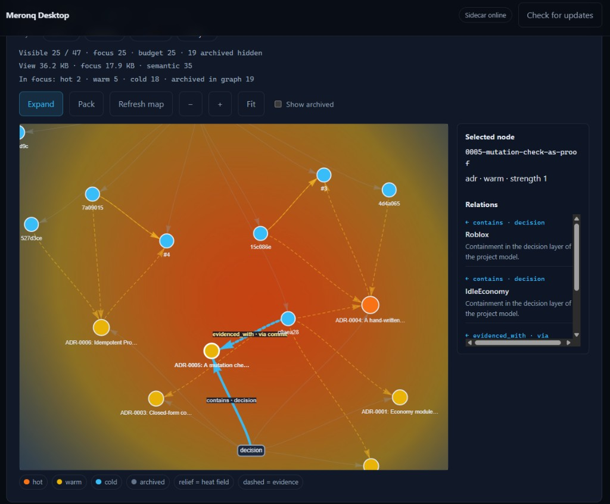

# IdleEconomy — Roblox economy & progression

Take-home / portfolio project: a **server-authoritative** idle economy
(currencies, exponential upgrades, prestige, offline income, Robux purchases)
with automated tests and documented architecture decisions.

| | |
|---|---|
| **Tests** | **153** console (Lune) · **7** Studio (TestEZ) · CI on every PR |
| **Repo** | [SergeyChagai/IdleEconomy](https://github.com/SergeyChagai/IdleEconomy) |
| **Review in 10 min** | [docs/playbook.md](docs/playbook.md) |

---

## What this demonstrates

1. **Client sends intent, not prices** — the server computes costs (ADR-0002).
2. **Pure economy modules** — same code runs in Roblox and Lune; math is tested without Studio (ADR-0001).
3. **Idempotent monetisation** — `ProcessReceipt` + PurchaseId ledger so a paid receipt is never granted twice (ADR-0006).
4. **Persistence that survives restarts** — ProfileStore sessions, schema migrations, offline payout without double-credit.
5. **Engineering memory (CEM)** — Meronq Desktop links ADRs ↔ commits ↔ modules (screenshot below).

---

## Tech stack (all used in this repo)

| Layer | Tool | Where it shows up |
|---|---|---|
| Language | **Luau** `--!strict` | `src/**`, `tests/**` |
| Sync | **Rojo** 7.7 | `default.project.json`, `test.project.json` |
| Packages | **Wally** 0.3 | `wally.toml` → Knit, TestEZ, ProfileStore |
| Framework | **Knit** 1.7 | Services + Controllers, remotes/signals |
| Persistence | **ProfileStore** 1.0 | `DataService` (server-only via Wally) |
| Monetisation | **MarketplaceService** | `MonetisationService` (ProcessReceipt, game passes, products) |
| Console tests | **Lune** 0.10 | `test.bat` → `tests/run.luau` |
| Studio tests | **TestEZ** 0.4 | `tests/studio/` + `test.project.json` |
| CI | **GitHub Actions** | `.github/workflows/tests.yml` |
| Knowledge graph | **Meronq CEM** (own) | ADRs + evidence in Desktop · [playbook](docs/playbook.md#meronq-cem) |

Nothing in the table is “listed only”: each item is wired into build, Play, or CI.

---

## Meronq CEM (own tooling)

Architectural decisions live as ADRs under `docs/adr/`. They are indexed into a
**Causal Engineering Memory** graph (Meronq Desktop): nodes for ADRs and
commits, edges for *contains decision* / *evidence*, heat for recent activity.



Example: ADR-0005 (mutation check as proof) links to the IdleEconomy project
and to the commits that keep that proof green.

---

## Quick start

```bash
wally install          # stop rojo serve first
rojo serve             # Studio → Rojo Connect → Play
test.bat               # 153 console tests (needs Lune on PATH)
```

Studio engine tests:

```bash
rojo serve test.project.json
# Connect → Play → Output: [StudioTests] … suite passed
```

| Doc | Audience |
|---|---|
| [**Playbook**](docs/playbook.md) | Hiring manager / reviewer — what to open first |
| [Architecture](docs/architecture.md) | Engineers — layers & services |
| [Monetisation setup](docs/monetisation.md) | Paste Creator Dashboard ids |
| [Roadmap](docs/roadmap.md) | Closed sprints 1–5 + ship polish |
| [ADRs](docs/adr/) | Why each decision was made |

---

## Design in one table

| | Server | Client |
|---|---|---|
| State | owns it | display snapshot |
| Price / reward | computes | never sent |
| Remotes | validated | **intent only** (“buy N of Pickaxe”) |

---

## Tests (why they exist)

Written around production failure modes, not coverage metrics:

- Closed-form upgrade cost matches buying level-by-level
- `maxAffordableLevels` off-by-one under float error
- Offline: reconnect farming, clock drift, no double payout
- Wallet atomicity on failed exchange
- Hostile remotes: `nil`, NaN, `math.huge`, huge strings
- Autoclicker token bucket
- PurchaseId ledger replay / history limit
- **Mutation check** (ADR-0005): remove `minSeconds` → exactly one test fails

---

## Layout

```
src/shared/Economy/     pure modules (no require) — Balance, Wallet, Validate, …
src/server/Services/    Economy · Data · Monetisation (Knit)
src/client/Controllers/ EconomyController HUD
tests/                  Lune suite
tests/studio/           TestEZ suite
docs/adr/               ADRs 0001–0006
.github/workflows/      console CI
```

---

## Deliberately unfinished

- **Catalog ids** in git are `0` — paste from Creator Dashboard before a live place ([guide](docs/monetisation.md)).
- **Studio TestEZ** is local (`rojo serve test.project.json`); CI runs the Lune suite.

---

## Language

Source and docs are **English**. Batch files are ASCII-only (`cmd.exe` OEM codepage).
